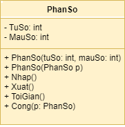
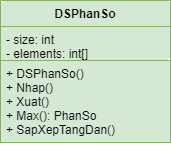

## Xử lý phân số

### 1 -Mục đích
- Vận dụng phương pháp lập trình HĐT giải quyết các xử lý cơ bản với phân số.

### 2 -Yêu cầu
#### 2.1 - Cài đặt các lớp
- Cài đặt lớp phân số với các thành phần như trong biểu đồ lớp sau.

- Cài đặt lớp danh sách phân số với các thành phần như trong biểu đồ lớp sau.

#### 2.2 - Chương trình chính
- Nhập một danh sách các phân số.
- In ra danh sách phân số dạng tối giản.
- Tìm phân số lớn nhất, nhỏ nhất.
- Sắp xếp danh sách theo thứ tự tăng dần, in ra danh sách sau khi sắp xếp.