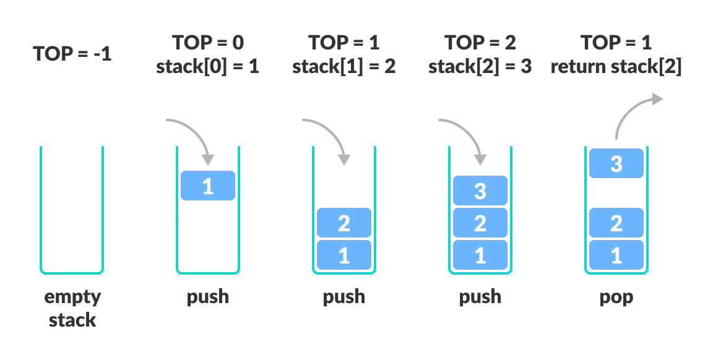

## Cài đặt ngăn xếp (Stack) 

### 1 - Mục đích
- Vận dụng phương pháp lập trình HĐT cài đặt lớp ngăn xếp.

- Sử dụng cấu trúc ngăn xếp giải quyết các bài toán:
    - Phân tích số tự nhiên ra thừa số nguyên tố.
    - Đổi số hệ thập phân sang hệ nhị phân, thập lục phân.

### 2 - Yêu cầu
#### 2.1 - Cài đặt lớp Stack mô tả các thao tác xử lý trên ngăn xếp với dữ liệu là số nguyên.

**Các thuộc tính:**

- top: chỉ số của phần tử trên cùng.
- Max: số phần tử đối đa.
- stack: mảng chứa các phần tử.

**Các phương thức:**

- Thiết lập: khởi tạo ngăn xếp rỗng.
- Push(int data): thêm phần tử.
- Pop(): lấy ra phần tử trên cùng.
- Peek(): in ra phần tử trên cùng.
- IsEmpty(): kiểm tra ngăn xếp có rỗng hay không.
- Print(): In ra danh sách phần tử.

#### 2.2 - Chương trình chính
- Sử dụng lớp Stack để phân tích một số nguyên thành thừa số nguyên tố, sau đó in ra các thừa số theo thứ tự ngược lại.
- Ví dụ:
    - Input: 12
    - Output: 3 * 2 * 2

- Sử dụng lớp Stack để đổi một số nguyên sang hệ nhị phân, thập lục phân.
- Ví dụ:
    - Input: 43
    - Output:
        
        Số 17 biểu diễn trong hệ nhị phân: 101011

        Số 17 biểu diễn trong hệ thập lục phân: 2B