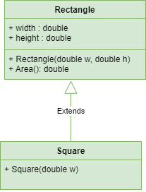

## Lớp hình vuông (Square) kế thừa lớp hình chữ nhật (Rectangle)

### Mục đích
- Cài đặt quan hệ thừa kế đơn giản.

### Yêu cầu
- Cài đặt các lớp theo lược đồ sau:

- Minh họa sử dụng các đối tượng trong chương trình chính.